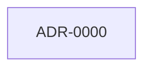

# ADR lineage

> **Regenerated by the `link-adr-graph` skill.** Body wholly rewritten on every run; hand-edits are blown away. No timestamps in the body — byte-stable across runs given the same ADR set. See `docs/log.md` (`adr | regenerated lineage`) for when.

## Graph

Solid arrow = supersedes; dashed arrow = amends. Superseded ADRs are marked.

## Lineage table

| id | title | status | supersedes | amends | superseded_by |
|----|-------|--------|------------|--------|---------------|
| ADR-0000 | Record architectural decisions as ADRs | Accepted | — | — | — |

## Topic clusters

ADRs grouped by shared tag (a tag appears below if ≥2 ADRs carry it). Use a cluster to find the current decision on a topic.

