# ADR lineage

> **Regenerated by the `link-adr-graph` skill.** Body wholly rewritten on every run; hand-edits are blown away. No timestamps in the body — byte-stable across runs given the same ADR set. See `docs/log.md` (`adr | regenerated lineage`) for when.

## Graph

Solid arrow = supersedes; dashed arrow = amends. Superseded ADRs are marked.

```mermaid
graph TD
  ADR_0000["ADR-0000"]
  ADR_0001["ADR-0001"]
  ADR_0002["ADR-0002"]
  ADR_0003["ADR-0003"]
  ADR_0004["ADR-0004"]
  ADR_0005["ADR-0005"]
  ADR_0006["ADR-0006"]
  ADR_0007["ADR-0007"]
  ADR_0008["ADR-0008"]
  ADR_0009["ADR-0009"]
  ADR_0010["ADR-0010"]
  ADR_0011["ADR-0011"]
  ADR_0012["ADR-0012"]
  ADR_0013["ADR-0013"]
  ADR_0014["ADR-0014"]
  ADR_0015["ADR-0015"]
  ADR_0016["ADR-0016"]
  ADR_0017["ADR-0017"]
  ADR_0018["ADR-0018"]
  ADR_0019["ADR-0019"]
  ADR_0020["ADR-0020"]
  ADR_0021["ADR-0021"]
  ADR_0022["ADR-0022"]
```

## Lineage table

| id | title | status | supersedes | amends | superseded_by |
|----|-------|--------|------------|--------|---------------|
| ADR-0000 | Record architectural decisions as ADRs | Accepted | — | — | — |
| ADR-0001 | Components are generic, typed and prop-driven, with no app knowledge | Accepted | — | — | — |
| ADR-0002 | Style only through --oui-* tokens declared for both themes | Accepted | — | — | — |
| ADR-0003 | Theme per subtree through data-theme on any ancestor | Accepted | — | — | — |
| ADR-0004 | Ship one stylesheet in one cascade layer | Accepted | — | — | — |
| ADR-0005 | WCAG AA is the contrast bar for tokens in both themes | Accepted | — | — | — |
| ADR-0006 | The primary stays #1677ff, with a derived text token and one recorded contrast exception | Accepted | — | — | — |
| ADR-0007 | Five entry points, and the native entry pulls in no markdown or highlighting engine | Accepted | — | — | — |
| ADR-0008 | Every input is two layers: a primitive and a field shell | Accepted | — | — | — |
| ADR-0009 | One example renderer, and the code shown is the code a consumer writes | Accepted | — | — | — |
| ADR-0010 | Biome is the one linter and formatter | Accepted | — | — | — |
| ADR-0011 | Coverage of 80 percent on four measures is part of the gate | Accepted | — | — | — |
| ADR-0012 | Visual baselines are kept per platform, and the Linux ones are made in CI | Accepted | — | — | — |
| ADR-0013 | Only the owner publishes to npm | Accepted | — | — | — |
| ADR-0014 | Content that does not fit is reached by scrolling, on by default | Accepted | — | — | — |
| ADR-0015 | Mandatory parts are enforced by a tripwire whose allow-list cannot rot | Accepted | — | — | — |
| ADR-0016 | Library first, then re-vendor: a consuming app writes no custom CSS | Accepted | — | — | — |
| ADR-0017 | Each command is a gate that proves one stated thing | Accepted | — | — | — |
| ADR-0018 | Every component has a story named Default | Accepted | — | — | — |
| ADR-0019 | Every form-usable component has a shallow, data-driven widget | Accepted | — | — | — |
| ADR-0020 | Options before variants: a variation is an option unless a true variant is cleaner | Accepted | — | — | — |
| ADR-0021 | Story factories and play functions are checked by the tripwire | Accepted | — | — | — |
| ADR-0022 | Accessibility is a gate in the Storybook test run, with an allow-list | Accepted | — | — | — |

## Topic clusters

ADRs grouped by shared tag (a tag appears below if ≥2 ADRs carry it). Use a cluster to find the current decision on a topic.

- **accessibility** — ADR-0005, ADR-0006, ADR-0022
- **api** — ADR-0001, ADR-0020
- **ci** — ADR-0012, ADR-0017
- **components** — ADR-0001, ADR-0008, ADR-0014, ADR-0015, ADR-0020
- **contrast** — ADR-0005, ADR-0006
- **css** — ADR-0002, ADR-0004
- **delivery** — ADR-0004, ADR-0016
- **documentation** — ADR-0009, ADR-0018
- **factories** — ADR-0009, ADR-0021
- **forms** — ADR-0008, ADR-0019
- **gate** — ADR-0011, ADR-0017, ADR-0022
- **philosophy** — ADR-0001, ADR-0020
- **process** — ADR-0000, ADR-0013, ADR-0015, ADR-0016, ADR-0017
- **storybook** — ADR-0009, ADR-0018, ADR-0021, ADR-0022
- **testing** — ADR-0011, ADR-0012, ADR-0015, ADR-0017, ADR-0021
- **theming** — ADR-0002, ADR-0003
- **tokens** — ADR-0002, ADR-0003, ADR-0005, ADR-0006
- **tripwire** — ADR-0015, ADR-0018, ADR-0021, ADR-0022
- **widgets** — ADR-0019, ADR-0020
